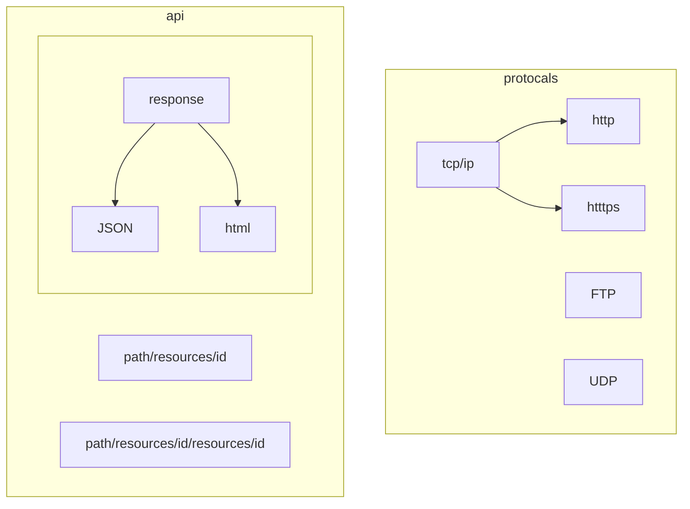

```mermaid
  flowchart TD
  subgraph pt["protocals"]
  TCP["tcp/ip"] --> HT["http"] & HTS["htttps"]
  FTP
  UDP
  end
  subgraph API["api"]
  P1["path/resources/id"]
  P2["path/resources/id/resources/id"]
  subgraph rs[ ]
  RS["response"] --> JSON & HTML["html"]
  end
  end
```
